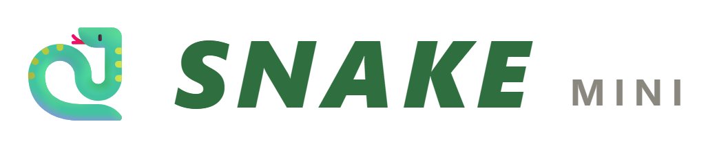

<div align="center">



# Snake Game

A classic **Snake** game in two flavors — a C++ console version and a
Game&nbsp;Boy‑styled browser version. Eat fruit, grow longer, and don't
bite your own tail.

[](src/snake.cc)
[](web/index.html)
[](LICENSE)

</div>

---

## Contents

- [Features](#features)
- [Project structure](#project-structure)
- [The web version](#the-web-version)
- [The C++ console version](#the-c-console-version)
- [Controls](#controls)
- [Scoring](#scoring)
- [License](#license)

## Features

- 🐍 Two implementations that share the same rules and scoring
- 🍎 Three fruit types with different point values (Apple, Banana, Cherry)
- 🎮 Retro Game Boy look in the browser: D‑pad, A/B buttons, LCD screen
- ⚡ Three difficulty levels (Easy / Normal / Hard) in the web version
- 🏆 Persistent high score in the browser (saved via `localStorage`)
- 🧱 Clean, object‑oriented C++ (`GameObject` base class, fruit hierarchy)

## Project structure

```
Snake_Game/
├── assets/
│   └── logo.png        # Brand logo
├── src/
│   └── snake.cc        # C++ console implementation
├── web/
│   └── index.html      # Browser implementation (self-contained)
├── build/              # Compiled binaries (git-ignored)
├── .gitignore
├── LICENSE
└── README.md
```

## The web version

The browser version is a single self‑contained `web/index.html` — no build
step, no dependencies.

**Run it:**

- Double‑click `web/index.html`, or
- Serve the folder and open it in a browser:
  ```bash
  # from the project root
  python -m http.server 8000
  # then visit http://localhost:8000/web/
  ```

## The C++ console version

> **Windows only.** The console version uses `<conio.h>` and `<windows.h>`
> (`_kbhit`, `_getch`, `Sleep`, `system("cls")`), so it targets Windows.

**Build & run** with g++ (MinGW):

```bash
g++ src/snake.cc -o build/snake.exe
build/snake.exe
```

Or with MSVC (Developer Command Prompt):

```bat
cl /EHsc /Fe:build\snake.exe src\snake.cc
build\snake.exe
```

## Controls

| Action        | Web version                        | Console version |
| ------------- | ---------------------------------- | --------------- |
| Move          | Arrow keys / `WASD` / on‑screen D‑pad | `W` `A` `S` `D` |
| Start / Play  | `Enter` / **START** button         | —               |
| Pause         | `Space`                            | —               |
| Quit          | —                                  | `X`             |

## Scoring

| Fruit  | Points |
| ------ | ------ |
| 🍎 Apple  | +10 |
| 🍌 Banana | +20 |
| 🍒 Cherry | +30 |

Each fruit you eat grows the snake by one segment. The game ends when the
snake hits a wall or its own tail.

## License

Released under the [MIT License](LICENSE). © 2026 Ningthem03.
